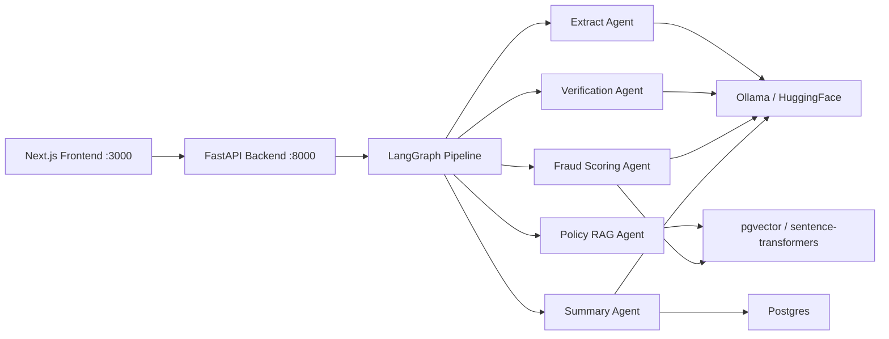

# Insurance Claims AI Pipeline — Technology Breakdown

> **Project Status: ✅ Running**
> - Frontend: `http://localhost:3000` (200 OK)
> - Backend API: `http://localhost:8000` (healthy)
> - Postgres + pgvector: `localhost:5432` (healthy)
> - Ollama LLM: `localhost:11434` (healthy)

---

## Architecture Overview

---

## Complete Technology List

### 1. AI / ML Frameworks

| Technology | Version | Used In | What It Does |
|-----------|---------|---------|--------------|
| **LangGraph** | ≥0.1 | [graph.py](https://github.com/DarshanMistry08/Insurance-Claim-AI/blob/main/pipeline/graph.py) | Orchestrates the 5-agent pipeline as a state machine (START → extract → policy_retrieval → verification → fraud_scoring → summary → END) |
| **LangChain** | ≥0.2 | Dependency for LangGraph | Foundation framework for building LLM-powered applications |
| **Ollama (llama3.2)** | latest | [extract_agent.py](https://github.com/DarshanMistry08/Insurance-Claim-AI/blob/main/agents/extract_agent.py), [verification_agent.py](https://github.com/DarshanMistry08/Insurance-Claim-AI/blob/main/agents/verification_agent.py), [fraud_scoring_agent.py](https://github.com/DarshanMistry08/Insurance-Claim-AI/blob/main/agents/fraud_scoring_agent.py), [summary_agent.py](https://github.com/DarshanMistry08/Insurance-Claim-AI/blob/main/agents/summary_agent.py) | Local LLM for field extraction (vision + text), policy verification, fraud classification, and summary generation |
| **sentence-transformers** | ≥2.7 | [policy_retrieval_agent.py](https://github.com/DarshanMistry08/Insurance-Claim-AI/blob/main/agents/policy_retrieval_agent.py), [fraud_scoring_agent.py](https://github.com/DarshanMistry08/Insurance-Claim-AI/blob/main/agents/fraud_scoring_agent.py) | Generates 384-dim embeddings using `all-MiniLM-L6-v2` for semantic search and duplicate detection |
| **HuggingFace Inference API** | — | [extract_agent.py](https://github.com/DarshanMistry08/Insurance-Claim-AI/blob/main/agents/extract_agent.py), [fraud_scoring_agent.py](https://github.com/DarshanMistry08/Insurance-Claim-AI/blob/main/agents/fraud_scoring_agent.py) | Cloud API for `Donut DocVQA` (document QA) and `BART-large-MNLI` (zero-shot classification) |
| **transformers** | ≥4.40 | Dependency | Hugging Face model support |
| **PyTorch** | ≥2.2 | Dependency | Deep learning backend for transformer models |

> **Where these can be used:** Any AI agent system — customer support chatbots, legal document analysis, medical record processing, financial auditing, content moderation pipelines, automated grading systems.

---

### 2. Specific AI Models

| Model | Purpose | Used In |
|-------|---------|---------|
| **naver-clova-ix/donut-base-finetuned-docvqa** | Visual document question answering — reads images and answers field-specific questions | [extract_agent.py](https://github.com/DarshanMistry08/Insurance-Claim-AI/blob/main/agents/extract_agent.py#L29) (primary extraction strategy) |
| **llama3.2** (via Ollama) | General-purpose LLM for vision, text extraction, verification reasoning, and summary generation | All 5 agent files |
| **all-MiniLM-L6-v2** | Sentence embedding model (384-dim) for semantic similarity | [policy_retrieval_agent.py](https://github.com/DarshanMistry08/Insurance-Claim-AI/blob/main/agents/policy_retrieval_agent.py#L45), [fraud_scoring_agent.py](https://github.com/DarshanMistry08/Insurance-Claim-AI/blob/main/agents/fraud_scoring_agent.py#L48) |
| **facebook/bart-large-mnli** | Zero-shot text classification (legitimate/suspicious/fraudulent) | [fraud_scoring_agent.py](https://github.com/DarshanMistry08/Insurance-Claim-AI/blob/main/agents/fraud_scoring_agent.py#L30) |

> **Where these can be used:** Invoice processing, receipt scanning, KYC document verification, exam paper grading, medical form digitization, sentiment analysis, topic classification.

---

### 3. Backend Framework

| Technology | Version | Used In | What It Does |
|-----------|---------|---------|--------------|
| **FastAPI** | ≥0.111 | [api/main.py](https://github.com/DarshanMistry08/Insurance-Claim-AI/blob/main/api/main.py) | REST API with 3 endpoints: `POST /claims/process`, `GET /claims/{doc_id}`, `GET /health` |
| **Uvicorn** | ≥0.29 | [start_api.py](https://github.com/DarshanMistry08/Insurance-Claim-AI/blob/main/start_api.py) | ASGI server running the FastAPI app with hot-reload |
| **Pydantic** | (via FastAPI) | [api/schemas.py](https://github.com/DarshanMistry08/Insurance-Claim-AI/blob/main/api/schemas.py), [agents/state.py](https://github.com/DarshanMistry08/Insurance-Claim-AI/blob/main/agents/state.py) | Data validation and serialization for API responses and agent state models |
| **python-multipart** | ≥0.0.9 | API file upload | Handles `multipart/form-data` for image file uploads |
| **python-dotenv** | ≥1.0 | [graph.py](https://github.com/DarshanMistry08/Insurance-Claim-AI/blob/main/pipeline/graph.py#L18) | Loads `.env` configuration variables |
| **CORS Middleware** | (FastAPI) | [api/main.py](https://github.com/DarshanMistry08/Insurance-Claim-AI/blob/main/api/main.py#L42-L47) | Allows cross-origin requests from the Next.js frontend |

> **Where these can be used:** Any web API — microservices, data pipelines, webhook handlers, ML model serving, real-time data processing APIs, IoT backends.

---

### 4. Database & Vector Search

| Technology | Version | Used In | What It Does |
|-----------|---------|---------|--------------|
| **PostgreSQL 16** | pg16 | [docker-compose.yml](https://github.com/DarshanMistry08/Insurance-Claim-AI/blob/main/docker-compose.yml#L4-L21) | Primary relational database storing documents, claims, golden labels, and policy clauses |
| **pgvector** | ≥0.2 | [init.sql](https://github.com/DarshanMistry08/Insurance-Claim-AI/blob/main/db/init.sql#L7) | Vector extension for Postgres — enables cosine similarity search on 384-dim embeddings |
| **HNSW Index** | — | [init.sql](https://github.com/DarshanMistry08/Insurance-Claim-AI/blob/main/db/init.sql#L44-L46) | Approximate nearest-neighbor index for fast vector search (m=16, ef_construction=64) |
| **psycopg2-binary** | ≥2.9 | All DB-connected agents | Python PostgreSQL adapter for running SQL queries |

**Database Tables (6):**

| Table | Purpose |
|-------|---------|
| `documents` | Source documents (images/PDFs) with metadata |
| `chunks` | Embedded text segments for RAG (384-dim vectors) |
| `golden_labels` | Ground-truth annotations for evaluation |
| `processed_claims` | Pipeline output with extracted fields, flags, LLM reasoning |
| `claims_history` | Past claim embeddings for duplicate detection |
| `policy_clauses` | Structured policy clause metadata linked to chunks |

> **Where these can be used:** Recommendation systems, semantic search engines, knowledge bases, plagiarism detection, similar-product matching, FAQ retrieval, duplicate detection systems.

---

### 5. Frontend

| Technology | Version | Used In | What It Does |
|-----------|---------|---------|--------------|
| **Next.js** | 16.2.11 | [frontend/](https://github.com/DarshanMistry08/Insurance-Claim-AI/blob/main/frontend) | React framework with server-side rendering for the claim processing dashboard |
| **React** | 19.2.4 | [page.tsx](https://github.com/DarshanMistry08/Insurance-Claim-AI/blob/main/frontend/src/app/page.tsx) | UI library — drag-and-drop upload, pipeline progress animation, results display |
| **TypeScript** | ^5 | All frontend files | Type-safe JavaScript |
| **Tailwind CSS** | ^4 | Styling | Utility-first CSS framework |
| **PostCSS** | — | Build pipeline | CSS processing |
| **ESLint** | ^9 | Code quality | Linting for Next.js/React code |

> **Where these can be used:** Admin dashboards, SaaS products, e-commerce platforms, analytics tools, CMS systems, portfolio websites, internal tools.

---

### 6. Observability & Tracing

| Technology | Version | Used In | What It Does |
|-----------|---------|---------|--------------|
| **Langfuse** | ≥2.0 | [agents/tracing.py](https://github.com/DarshanMistry08/Insurance-Claim-AI/blob/main/agents/tracing.py) | LLM observability — traces each agent node's inputs, outputs, latency, and errors |
| **structlog** | ≥24.1.0 | [agents/tracing.py](https://github.com/DarshanMistry08/Insurance-Claim-AI/blob/main/agents/tracing.py#L12) | Structured logging with key-value pairs for production debugging |
| **Python logging** | stdlib | All agent files | Standard logging for warnings and errors |

> **Where these can be used:** Production ML systems, API monitoring, audit trails, debugging LLM applications, cost tracking for LLM calls, A/B testing AI features.

---

### 7. Data & OCR

| Technology | Version | Used In | What It Does |
|-----------|---------|---------|--------------|
| **HuggingFace datasets** | ≥2.19 | [pull_funsd.py](https://github.com/DarshanMistry08/Insurance-Claim-AI/blob/main/scripts/pull_funsd.py), [pull_docvqa.py](https://github.com/DarshanMistry08/Insurance-Claim-AI/blob/main/scripts/pull_docvqa.py) | Downloads FUNSD and DocVQA datasets for training/evaluation |
| **Pillow (PIL)** | ≥10.0 | Image processing | Image manipulation and OCR preprocessing |
| **EasyOCR** | optional | [extract_agent.py](https://github.com/DarshanMistry08/Insurance-Claim-AI/blob/main/agents/extract_agent.py#L141-L144) | OCR fallback for text extraction from images |
| **pytesseract** | optional | [extract_agent.py](https://github.com/DarshanMistry08/Insurance-Claim-AI/blob/main/agents/extract_agent.py#L149-L153) | Alternative OCR engine (Google Tesseract wrapper) |
| **pandas** | ≥2.1 | [scripts/](https://github.com/DarshanMistry08/Insurance-Claim-AI/blob/main/scripts) | Data handling for golden set CSV processing |
| **rich** | ≥13.0 | CLI scripts | Beautiful terminal output with tables and progress bars |
| **click** | ≥8.1 | CLI scripts | Command-line argument parsing |

> **Where these can be used:** Document digitization, bank check processing, license plate recognition, medical prescription reading, form processing, data pipeline ETL.

---

### 8. DevOps & Infrastructure

| Technology | Used In | What It Does |
|-----------|---------|--------------|
| **Docker** | [docker-compose.yml](https://github.com/DarshanMistry08/Insurance-Claim-AI/blob/main/docker-compose.yml) | Containerizes all 4 services (Postgres, Ollama, API, Frontend) |
| **Docker Compose** | [docker-compose.yml](https://github.com/DarshanMistry08/Insurance-Claim-AI/blob/main/docker-compose.yml) | Multi-container orchestration with health checks and dependency ordering |
| **backend.Dockerfile** | [backend.Dockerfile](https://github.com/DarshanMistry08/Insurance-Claim-AI/blob/main/backend.Dockerfile) | Python API container build |
| **frontend.Dockerfile** | [frontend/frontend.Dockerfile](https://github.com/DarshanMistry08/Insurance-Claim-AI/blob/main/frontend/frontend.Dockerfile) | Next.js container build |
| **LangGraph Studio** | [langgraph.json](https://github.com/DarshanMistry08/Insurance-Claim-AI/blob/main/langgraph.json) | Visual debugger for the state machine graph |

> **Where these can be used:** Microservice deployments, CI/CD pipelines, cloud hosting (AWS ECS, GCP Cloud Run, Azure Container Apps), local development environments.

---

## Pipeline Flow (5 Agents)

```mermaid
flowchart TD
    START(["📄 Upload Claim Image"]) --> A
    A["🔍 Extract Agent<br/><i>Donut → Ollama Vision → OCR+Text</i>"] --> B
    B["📋 Policy Retrieval Agent<br/><i>pgvector semantic search</i>"] --> C
    C["✅ Verification Agent<br/><i>LLM structured JSON verdict</i>"] --> D
    D["⚠️ Fraud Scoring Agent<br/><i>BART zero-shot + duplicate detection</i>"] --> E
    E["🤖 Summary Agent<br/><i>LLM narrative + DB persist</i>"] --> END(["📊 Claim Result"])

    style A fill:#1e3a5f,stroke:#3b82f6
    style B fill:#1e3a5f,stroke:#8b5cf6
    style C fill:#1e3a5f,stroke:#10b981
    style D fill:#1e3a5f,stroke:#f59e0b
    style E fill:#1e3a5f,stroke:#ef4444
```

---

## Real-World Applications

| Domain | How This Architecture Applies |
|--------|------------------------------|
| **Insurance** | Exact use case — claim processing, fraud detection, policy verification |
| **Banking & Finance** | Loan application processing, KYC verification, transaction fraud detection |
| **Healthcare** | Medical records extraction, insurance pre-authorization, clinical trial document processing |
| **Legal** | Contract analysis, compliance checking, due diligence document review |
| **Government** | Tax form processing, permit applications, benefits claim validation |
| **Real Estate** | Property inspection reports, title document verification, appraisal analysis |
| **HR / Recruitment** | Resume parsing, background check verification, employee onboarding forms |
| **Supply Chain** | Invoice processing, shipping document verification, customs form automation |
| **Education** | Assignment grading with rubric-based AI, transcript processing, application review |
| **Customer Support** | Ticket classification, sentiment-based routing, auto-response generation |

---

## Summary Stats

| Metric | Count |
|--------|-------|
| **Total Technologies** | 30+ |
| **AI/ML Models** | 4 |
| **Agent Nodes** | 5 |
| **API Endpoints** | 3 |
| **Database Tables** | 6 |
| **Docker Services** | 4 |
| **Extraction Fields** | 10 |
| **Flag Conditions** | 4 |
